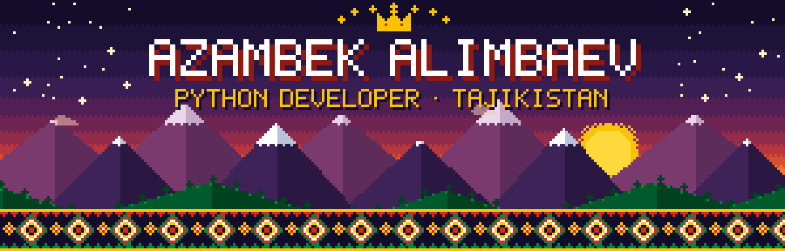
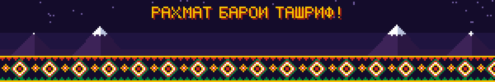

 

- 🐍 Разрабатываю бэкенд на **Python** — FastAPI, Flask
- 🤖 Делаю **Telegram-ботов** и Telegram WebApp для бизнеса
- ⚙️ Автоматизирую процессы: обработка Excel-реестров, интеграции с API, n8n
- 🐳 Разворачиваю сервисы в **Docker** за nginx на собственных серверах
- 🌱 Сейчас изучаю: AI-интеграции (LLM API) и архитектуру веб-приложений

  
   
  

<table>
<tr>
<td width="50%" valign="top">

#### 🗳️ [Hackathon Jury Vote](https://github.com/GostWarrir186/hackathon-jury-vote)
Система онлайн-голосования жюри и зрителей для финала хакатона: персональные QR, взвешенные критерии, усечённое среднее, тай-брейк, пульт секретариата и экран итогов.

`FastAPI` `SQLite` `Docker` `Jinja2`

</td>
<td width="50%" valign="top">

#### 📦 [Telegram WebApp](https://github.com/GostWarrir186/mavsim-webapp)
Страницы Telegram WebApp для ботов службы доставки: форма заказа клиента, кабинет курьера, панель и статистика менеджера.

`HTML` `CSS` `JavaScript` `Telegram WebApp`

</td>
</tr>
<tr>
<td width="50%" valign="top">

#### 📊 [Excel Processor](https://github.com/GostWarrir186/excel-processor)
Сервис автоматической проверки товарных реестров в Excel: находит запрещённые позиции по ключевым словам и с помощью AI, подсвечивает их цветом.

`Flask` `openpyxl` `lxml` `LLM API`

</td>
<td width="50%" valign="top">

#### 🎨 [Excel Colorizer](https://github.com/GostWarrir186/excel-colorizer)
Сервис, который подсвечивает строки Excel-файла по сумме с учётом актуального курса USD → TJS.

`Flask` `openpyxl` `REST API`

</td>
</tr>
</table>

  

  
  

  

<picture>
  <source media="(prefers-color-scheme: dark)" srcset="https://raw.githubusercontent.com/GostWarrir186/GostWarrir186/output/snake-dark.svg" />
  
</picture>

